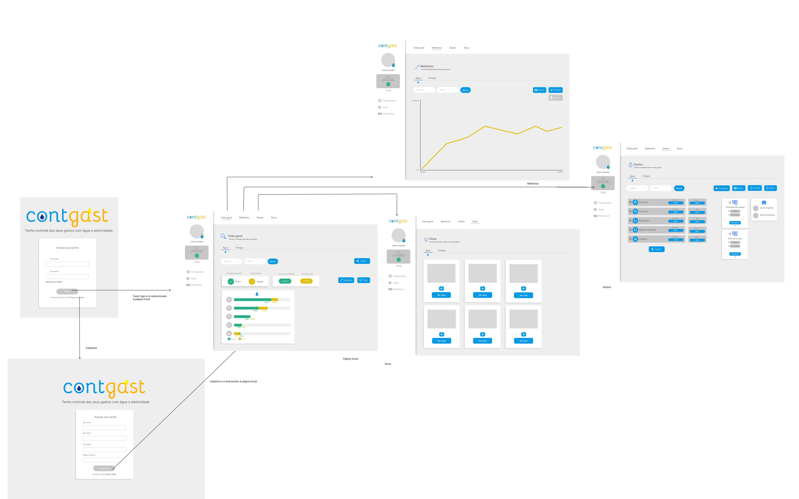
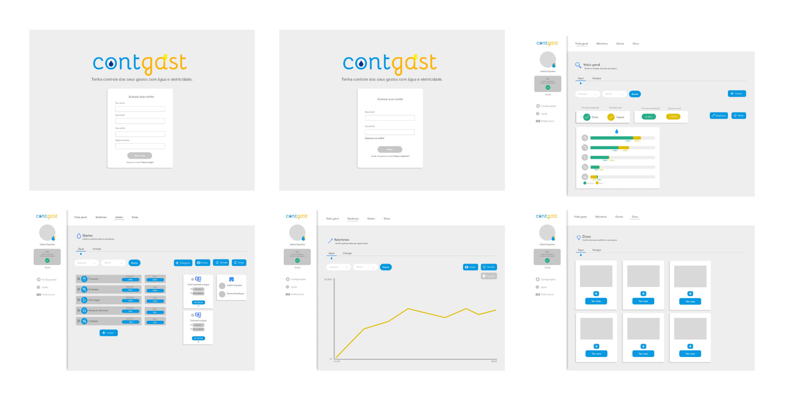
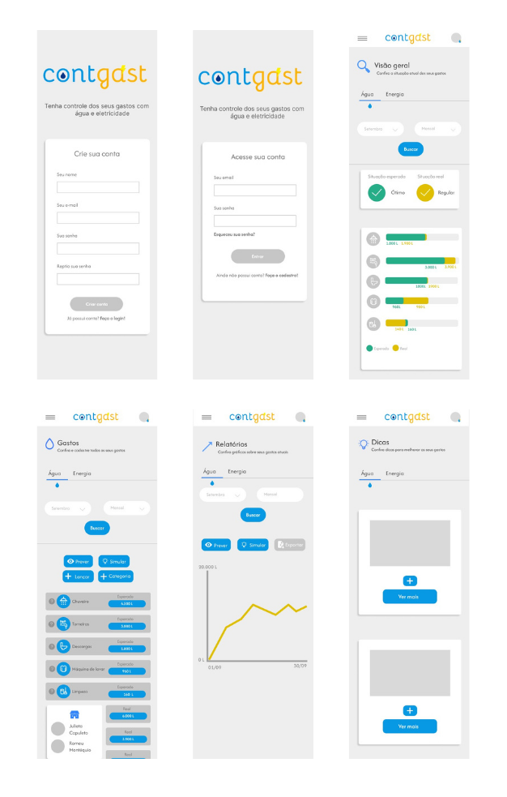

## Problema

Os brasileiros destinam, em média, cerca de 20% de sua renda ao pagamento de contas de água e energia elétrica. Contudo, muitos consumidores não compreendem claramente a origem desses valores. Frequentemente, durante o pagamento, não possuem plena consciência do seu consumo ou se o valor cobrado está de acordo com o uso real. Essas dúvidas levam a questionamentos como: o valor está adequado ao número de moradores? O consumo médio por pessoa está dentro do esperado? Existe a possibilidade de furtos de energia ou vazamentos de água que possam estar inflacionando os custos?
Em 2023, o furto de energia no Brasil atingiu um recorde. Segundo uma reportagem de Geral Campos Jr., publicada no site Poder360, as chamadas perdas não técnicas — popularmente conhecidas como "gatos" — aumentaram 20% em relação ao ano anterior, alcançando 40,8 terawatts por hora (TWh). Essa realidade agrava ainda mais a insegurança dos consumidores quanto à confiabilidade das suas contas, uma vez que muitos podem estar pagando por energia furtada sem sequer saber.
 Além disso, muitos consumidores carecem de informações claras sobre o histórico de seus gastos ao longo do tempo, o que dificulta a previsão de futuros valores e o acompanhamento de padrões de consumo. Isso impede uma gestão eficiente das despesas e limita comparações com a média nacional.
 Por fim, aqueles que buscam adotar um estilo de vida mais ecológico enfrentam dificuldades para entender como reduzir seu consumo de energia de maneira eficaz, limitando sua capacidade de contribuir para práticas sustentáveis e causas ambientais.

## Objetivos

O ContGast foi desenvolvido com o objetivo de oferecer uma ferramenta eficaz para
o gerenciamento de contas de energia e água dos usuários, promovendo uma melhor
compreensão dos gastos passados e futuros. O objetivo geral do projeto é fornecer
uma plataforma prática que permita aos usuários mapear, registrar e armazenar suas
contas, facilitando o acompanhamento e controle do consumo de recursos
energéticos e hídricos.
Para atingir esse objetivo geral, foram definidos alguns objetivos específicos.
Primeiramente, o software visa fornecer suporte ao usuário na identificação de
possíveis inconsistências entre o consumo real e o valor cobrado, oferecendo
transparência e confiança na análise das contas. Em segundo lugar, o ContGast tem
como propósito apresentar orientações personalizadas para aqueles que desejam
reduzir seus gastos, promovendo o uso eficiente de energia e água. Por fim, o projeto
também inclui a criação de uma base de dados com o consumo médio de diferentes
aparelhos e eletrodomésticos, permitindo que o usuário saiba com precisão o quanto
cada equipamento consome e como isso impacta em suas despesas.
Dessa forma, o ContGast não só ajuda os usuários a monitorarem seus gastos, mas
também promove a educação sobre consumo consciente, alinhando-se com a
crescente demanda por soluções sustentáveis e financeiras.

## Justificativa

A compreensão deficiente dos gastos com água e energia elétrica gera insegurança
e insatisfação entre os consumidores brasileiros. Com uma média de 20% da renda
familiar destinada a essas contas, é alarmante que muitos não consigam rastrear a
origem desses valores ou verificar se refletem o consumo real. O aumento alarmante
de 20% nos furtos de energia em 2023, alcançando 40,8 TWh, destaca a urgência de
soluções que promovam transparência e educação no consumo.
Além disso, a falta de acesso a dados históricos sobre gastos impede uma análise
eficaz e a tomada de decisões informadas. O nosso projeto se propõe a sanar essas
lacunas, oferecendo uma plataforma que não apenas informa, mas empodera os
consumidores a monitorar e gerenciar seus gastos. Isso não só ajudará a esclarecer
a confiabilidade das contas, mas também incentivará práticas mais sustentáveis.

## Público-Alvo

O público-alvo do ContGast é diversificado, abrangendo adultos e jovens adultos na
faixa etária de 20 a 40 anos. Esses indivíduos, geralmente com nível de escolaridade
médio a superior, estão em busca de uma compreensão mais profunda sobre suas
contas de água e energia elétrica. Muitos deles residem em áreas urbanas, onde os
custos com esses serviços podem ser mais elevados e variados.
Esse grupo inclui consumidores que questionam a precisão das cobranças e desejam
monitorar seus gastos de forma mais eficaz. Além disso, o software é especialmente
relevante para aqueles que aspiram a um estilo de vida mais sustentável, promovendo
práticas ecológicas. As funcionalidades do ContGast, como simulações de gastos com
diferentes fontes energéticas, visam não apenas fornecer informações, mas também
capacitar os usuários a fazer escolhas mais conscientes.

## Personas e Historia de Usuarios

**EU COMO... PERSONA
QUERO/PRECISO... FUNCIONALIDADE
PARA... MOTIVO**

### Marcella Almeida

**Idade:** 30

**Hobby:** Jardinagem

**Trabalho:** Professora de Geografia

**Personalidade:** Marcella é uma mãe jovem com dois filhos. Ela é calma, decidida e cuidadosa. Ela é amante da natureza e do movimento ecológico. Com seu marido tem uma relação estável.

**Sonhos:** Conseguir criar seus filhos com cuidado e atenção, equilibrando a sua vida profissional, a maternidade e seus hobbys, além de ter uma vida financeira mais tranquila.

**Objetos e Lugares:** Marcella utiliza muito seu celular com aplicativos de interface simples, porém detalhadas com várias funções. Por ter uma vida atarefada ela lida muito com eletrodomésticos contendo botões e aberturas. Devido ao seu trabalho constantemente lida com livros e cadernos tendo inúmeras informações além de possuir um vocabulário rebuscado. Seus lugares favoritos são a sua casa, sua sala de aula e seu jardim. Por seu hobby ser a jardinagem ela também constantemente mexe com água e terra além de ter conhecimento sobre gasto de água.

**Objetivos Chave:** Marcella quer com esse sistema calcular a quantidade de energia e água que ela mais a sua família gastam. Por ser uma entusiasta do movimento verde com essa ferramenta ela saberá quanto gasta e assim equilibrar mais o gasto tanto pela questão verde quanto pela financeira.

**Como Devemos Tratá-la:** Gosta de ser sempre bem tratada, tendo a suas dúvidas respondidas e com uma justificativa plausível com fatos.

**Nunca Devemos:** Não suporta atitudes grosseiras e burocracia. Tende sempre a buscar aplicações simples sem muitos malabares. Gosta que sempre levem em consideração a sua família.

### Joel Santos

**Idade:** 27 anos

**Hobby:** Vídeo games

**Trabalho:** Técnico em Eletrônica

**Personalidade:** Joel é um homem simples, recém-formado em eletrônica. Ele passa boa parte do seu tempo livre jogando vídeo games e programando. É calado, inteligente e sabe defender seus direitos.

**Sonhos:** Ter uma maior estabilidade financeira e conseguir realizar suas vontades.

**Objetos e Lugares:** Joel está familiarizado com termos técnicos do mundo tecnológico. Em seu trabalho, lida com cabos, redes, fiações e outros elementos eletrônicos. Como amante de vídeo games, ele também está habituado a interfaces com menus, ícones e opções.

**Objetivos Chave:** Joel quer comparar seus gastos reais de energia com o que ele deveria estar pagando, para questionar os valores cobrados pela distribuidora de energia.

**Como Devemos Tratá-lo:** Joel preza por praticidade e facilidade de uso. Com seu conhecimento em programação, prefere interfaces objetivas e diretas, com informações claras e acessíveis.

**Nunca Devemos:** Joel detesta programas com layouts confusos e desleixados. Ele prefere ações rápidas e diretas, sem a necessidade de fornecer dados em excesso para obter uma solução simples. Evite perguntas desnecessárias ou que não agreguem valor ao processo.

### João Silva

**Idade:** 22 anos

**Hobby:** Jogar videogame, assistir séries e filmes

**Trabalho:** Estudante de Engenharia

**Personalidade:** João é um jovem extrovertido e sociável. Gosta de estar em contato com as pessoas e de participar de eventos. É um grande fã de tecnologia e adora ficar por dentro das últimas novidades. É dedicado aos estudos e tem grandes ambições para o futuro.

**Sonhos:** Se formar em Engenharia e conseguir um emprego em uma grande empresa. Também sonha em viajar para outros países e conhecer novas culturas.

**Objetos e Lugares:** João usa frequentemente seu notebook e smartphone, além de passar tempo com livros e em locais como sala de aula, biblioteca e laboratórios. Ele também gosta de plataformas de streaming.

**Objetivos Chave:** João quer aprender mais sobre novas tecnologias para aplicá-las em seu cotidiano, ter acesso a conteúdo de qualidade para apoiar seus estudos e, no futuro, encontrar um emprego onde possa utilizar suas habilidades.

**Como Devemos Tratá-lo:** É importante tratá-lo de forma respeitosa e atenciosa, para que ele se sinta acolhido e valorizado.

**Nunca Devemos:** Nunca tratá-lo de forma desrespeitosa ou condescendente. Evitar comentários negativos sobre seus hobbies ou interesses, para que ele não se sinta constrangido.

### Maria Santos

**Idade:** 35 anos

**Hobby:** Cozinhar, ler e cuidar do jardim

**Trabalho:** Dona de casa

**Personalidade:** Maria é uma mulher dedicada à família e ao lar. Gosta de cuidar da casa, preparar refeições saudáveis e criar um ambiente aconchegante para seus familiares. É organizada e responsável, sempre atenta às necessidades da família.

**Sonhos:** Maria deseja criar um ambiente acolhedor e estável para sua família, conciliando as atividades domésticas com o seu tempo para leitura e jardinagem.

**Objetos e Lugares:** Ela usa muitos eletrodomésticos no dia a dia, como fogão, máquina de lavar e aspirador, além de contar com seu celular para acessar aplicativos práticos. Seus lugares favoritos são a cozinha e o jardim, onde passa a maior parte do tempo.

**Objetivos Chave:** Maria busca formas de otimizar o consumo de energia e água em casa, visando reduzir custos e contribuir para a sustentabilidade.

**Como Devemos Tratá-la:** Gosta de um tratamento atencioso e aprecia quando suas dúvidas são respondidas com clareza.

**Nunca Devemos:** Evitar atitudes grosseiras e processos burocráticos, pois ela prefere soluções práticas e simples, que levem em consideração as necessidades de sua família.

### Gabriel Santana

**Idade:** 19

**Hobby:** Mountain Bike

**Trabalho:** Analista Financeiro

**Personalidade:** Gabriel é organizado, calmo e detalhista. Ele está sempre buscando formas de melhorar sua vida e a das pessoas ao seu redor. Adepto a práticas de dieta, também é paciente e gosta de ensinar sobre finanças pessoais. Valoriza a sustentabilidade, estando sempre atento ao uso consciente de recursos, como energia. Apesar de ser sério no trabalho, é descontraído com amigos e adora conversar sobre tecnologia e ciência.

**Sonhos:** Gabriel sonha em ter uma casa no campo, cercada pela natureza, onde possa relaxar e se desconectar da correria do dia a dia. Ele também quer desenvolver um projeto de educação financeira para jovens, ajudando-os a entender o valor do dinheiro e como gerenciá-lo de forma inteligente desde cedo. Além disso, deseja, em algum momento, tirar um ano sabático para viajar.

**Objetos e Lugares:**
1. **Notebook:** Para trabalho e gerenciamento de finanças familiares.
2. **Smartphone:** Para comunicação e uso de aplicativos de finanças e controle de consumo.
3. **Bicicleta de Mountain Bike:** Para passeios e trilhas nos finais de semana.
4. **Garrafas Reutilizáveis de Água:** Para reduzir o uso de plásticos e garantir o consumo consciente.

**Objetivos Chave:** Usar o site permite que Gabriel tenha uma visão detalhada do seu consumo, possibilitando que tome decisões informadas para economizar dinheiro e minimizar seu impacto ambiental.

**Como Devemos Tratá-lo:** Gosta de clareza e simplicidade, com uma experiência personalizada que ofereça dicas sobre sustentabilidade. A agilidade também é indispensável para ele.

**Nunca Devemos:**
- Complicar a experiência.
- Fornecer informações genéricas.
- Ignorar o contexto sustentável.
- Ser vagos ou indefinidos.

## História de usuários

- **Marcela Almeida:** "Como usuária, desejo aprender sobre outras formas de energia para contribuir com a preservação do meio ambiente."

- **Joel Santos:** "Como usuário, quero verificar os gastos da minha residência para assegurar que estão corretos e que não estou sendo cobrado indevidamente."

- **Clara Matos:** "Como usuária, gostaria que o site armazenasse meus dados para que eu possa acompanhar minha vida financeira de forma contínua."

- **Gabriel Santana:** "Como usuário, desejo que o site me indique a quantidade ideal de água a ser consumida em minha residência, com o objetivo de contribuir para a proteção do meio ambiente."

## Requisitos

Lista de requisitos funcionais e não funcionais.

**Funcionais:**

RF-001: O sistema deve permitir que o usuário cadastre seus gastos de energia e de água. Prioridade: Alta

RF-002: O sistema deve permitir que o usuário cadastre suas informações pessoais e a manutenção dessas informações pessoais. Prioridade: Alta

RF-003: O sistema deve calcular e exibir a diferença do consumo real e do esperado, tanto para consumo geral quanto para os eletrodomésticos. Prioridade: Alta

RF-004: O sistema deve permitir ao usuário visualizar um período específico de suas informações sobre seus gastos. Prioridade: Média

RF-005: O sistema deve gerar relatórios em formato de texto com as informações baseadas do usuário. Prioridade: Média

RF-006: A aplicação deve fornecer dicas personalizadas baseadas na situação do eletrodoméstico do usuário. Prioridade: Baixa

RF-007: O sistema simula gastos com diferentes fontes de energia. Prioridade: Baixa

RF-008: O sistema calcula e mostra os gastos em reais. Prioridade: Média

RF-009: O sistema permite baixar relatórios em PDF e enviá-los por e-mail. Prioridade: Baixa

RF-010: O sistema fornece uma previsão de gastos totais para um período. Prioridade: Média

RF-011: O sistema tem uma seção de ajuda para os usuários. Prioridade: Baixa

RF-012: O sistema permite enviar feedback e sugestões. Prioridade: Baixa

**Não Funcionais:**

RNF-001: O site deve ser responsivo, adaptando-se a diferentes tamanhos de tela e 
dispositivos. -Prioridade Alta

RNF-002: O sistema deve processar rapidamente as requisições do usuário, com 
tempo de resposta não superior a 5 segundos. -Prioridade Média

RNF-003: O site deve ser fácil de usar, garantindo uma experiência intuitiva e 
acessível para todos os usuários. -Prioridade Alta

RNF-004: O site deve ser seguro, implementando medidas de proteção de dados e 
privacidade dos usuários. -Prioridade Alta

RNF-005: O site deve ser compatível com os principais navegadores, incluindo 
Chrome, Firefox, Safari e Edge. -Prioridade Alta

RNF-006: O site deve operar de forma contínua, garantindo disponibilidade 24 horas 
por dia, 7 dias por semana. -Prioridade Média

## User Flow

O fluxo de usuário (User Flow) é uma técnica que permite ao desenvolvedor mapear todo fluxo de telas do site ou app. Essa técnica funciona para alinhar os caminhos e as possíveis ações que o usuário pode fazer junto com os membros de sua equipe. 

No link a seguir, está representado o User Flow entre os protótipos das telas que compõem o sistema ContGast.

 - [User Flow Figma](https://www.figma.com/design/oi5DgFxqOPBsD0stUMQ0jn/User-Flow?node-id=0-1&t=I2f0MCytSmgya09c-1)

## Wireframes

A interface do ContGast foi projetada com foco em simplicidade e didática, assegurando fácil uso por qualquer usuário. A identidade visual da aplicação é composta pelas cores predominantes branco, azul e amarelo. A interface, disponível nas versões web e mobile, é composta por quatro páginas principais: "Visão Geral", "Relatórios", "Gastos" e "Dicas". A função de cada uma dessas telas será detalhada posteriormente. Além disso, a interface foi projetada para conter ícones de ajuda distribuídos pelas telas, facilitando a compreensão de cada seção e reforçando o caráter didático do sistema.

A seguir, serão explicadas cada uma das telas da interface do sistema, e, em seguida, apresentaremos os links de cada um dos protótipos.

Tela inicial: Nessa tela, o usuário obtém uma panorama geral de seus gastos reais e esperados de água e energia em um determinado período.

Relatórios: Essa tela permite a visualização de gráficos detalhados sobre o consumo do usuário em um determinado período. O usuário também pode prever o consumo futuro com base nos dados atuais, simular o valor das contas ao seguir dicas de economia, e exportar relatórios para Excel.

Gastos: Nessa tela, o usuário pode cadastrar categorias de gastos, acompanhar o consumo real e esperado de cada item, acompanhar os valores reais e esperados das contas mensais e registrar novos gastos.

Dicas: Essa tela exibe sugestões de economia fornecidas pelo sistema. O usuário pode seguir determinadas dicas, e o consumo esperado será ajustado com base nas dicas aplicadas.

[Wireframe Interativo - WEB](https://www.figma.com/proto/6fZOCVAmiKTQvtfgX6iJIC/Interface-Web?node-id=52-419&node-type=canvas&t=6bafcn79ZTXnPp0q-1&scaling=min-zoom&content-scaling=fixed&page-id=23%3A279&starting-point-node-id=81%3A133)

[Wireframe Interativo - Mobile](https://www.figma.com/proto/IoxKG9q25EMcx8i8Fj7ZC5/Interface-Mobile?node-id=34-1168&node-type=canvas&t=lM5OC5u9wQs8142I-1&scaling=contain&content-scaling=fixed&page-id=12%3A2&starting-point-node-id=34%3A1168)

## Gestão de Projetos

Durante o desenvolvimento deste projeto, adotamos o framework Scrum, designando Arthur Lacorte como Scrum Master e Victor Torres como Product Owner (PO) para facilitar a organização e a eficiência do time. Essa estrutura nos permitiu dividir as tarefas de maneira estratégica, levando em consideração as habilidades específicas de cada desenvolvedor — Adrielly Lima, Arthur Lacorte, Arthur Moura, Guilherme Coelho, Victor Torres e Victor Wilson — e priorizando entregas de forma ágil e contínua. A documentação do projeto foi realizada por toda a equipe, assegurando que cada etapa do processo estivesse devidamente registrada e acessível a todos.

Além disso, utilizamos o método Kanban para acompanhar o progresso das atividades, organizando nosso fluxo de trabalho em três quadros: um para tarefas não começadas, um para tarefas em andamento e um para tarefas concluídas. Essa abordagem se mostrou extremamente útil para a designação correta das tarefas e para a organização geral do projeto, proporcionando uma visão clara sobre ações pendentes e concluídas, garantindo transparência e coordenação entre os membros da equipe.

Empregamos a plataforma Miro para estruturar nossas atividades de Design Thinking, o que foi fundamental para aprofundar nossa compreensão do projeto e identificar oportunidades de melhorias. O Figma foi a plataforma escolhida para elaborar os fluxos de usuário, wireframes das telas e o protótipo interativo, assegurando uma experiência de usuário bem estruturada e coerente com os objetivos do projeto. Além disso, utilizamos o GitHub como repositório de código, permitindo um controle eficiente de versionamento e garantindo que todo o processo estivesse devidamente documentado.

- [Figma - Wireframes das telas e protótipo interativo](https://www.figma.com)
- [Miro - Ferramenta para etapa do Design Thinking](https://miro.com/pt/)
- [GitHub - Repositório de Código e Documentação](https://github.com)

